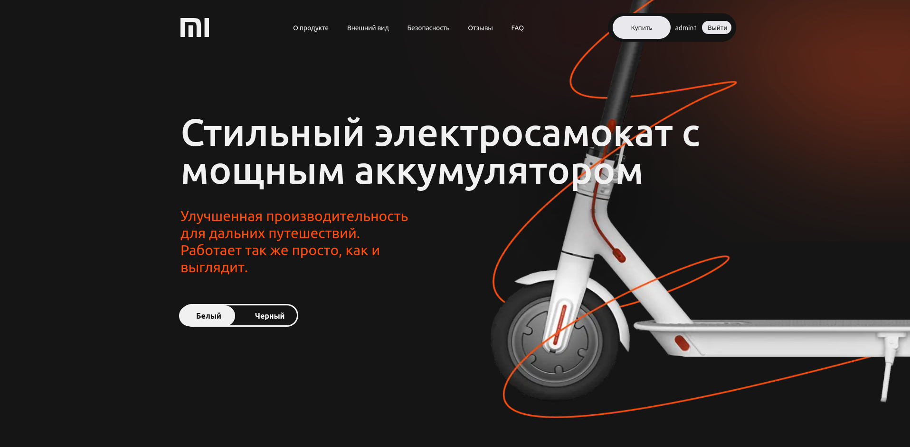

# 🚴 ElectroBike



E-commerce приложение для продажи электрических велосипедов. Next.js + Flask + MySQL, запускается в Docker.


## ✨ Возможности

- Каталог продукции с фильтрацией
- Система регистрации и авторизации
- Корзина и оформление заказов
- Отзывы и рейтинги
- Адаптивный дизайн (светлая/тёмная тема)
- Полная контейнеризация Docker

## 🛠️ Стек

- **Frontend**: Next.js, React, SCSS
- **Backend**: Flask, SQLAlchemy
- **Database**: MySQL 8.0
- **DevOps**: Docker Compose

## 📋 Требования

- Docker 20.10+
- Docker Compose 1.29+

## 🚀 Установка и запуск

### 1. Клонируйте репозиторий

```bash
git clone https://github.com/mapanit/electro-bike.git
cd electro-bike
```

### 2. Запустите Docker

```bash
docker-compose up --build
```

Или с Makefile:

```bash
make up
```

### 3. Откройте в браузере

- **Frontend**: http://localhost:3030
- **Backend API**: http://localhost:8030


## 🔐 БД (Development)

Хост: localhost:3307
Пользователь: root
Пароль: root
База: mi


## 📁 Структура

- electro-bike/
- app/                # Next.js (Frontend)
- backend/            # Flask (Backend)
- docker-compose.yml
- Dockerfile.next
- README.md
